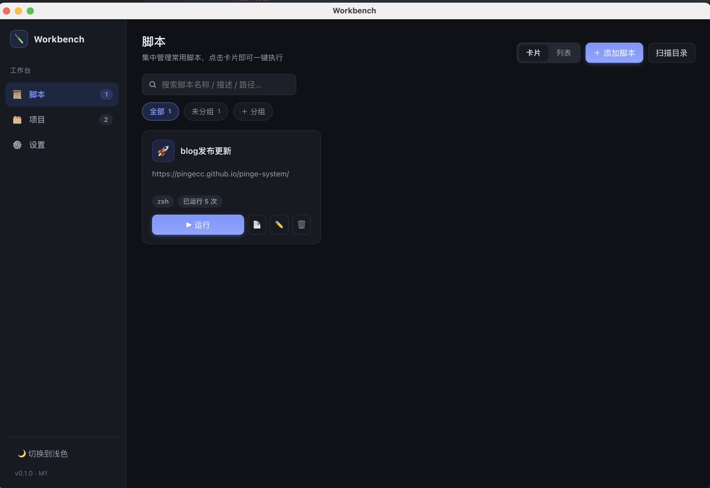
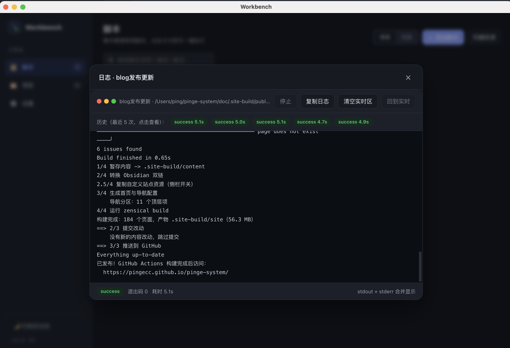
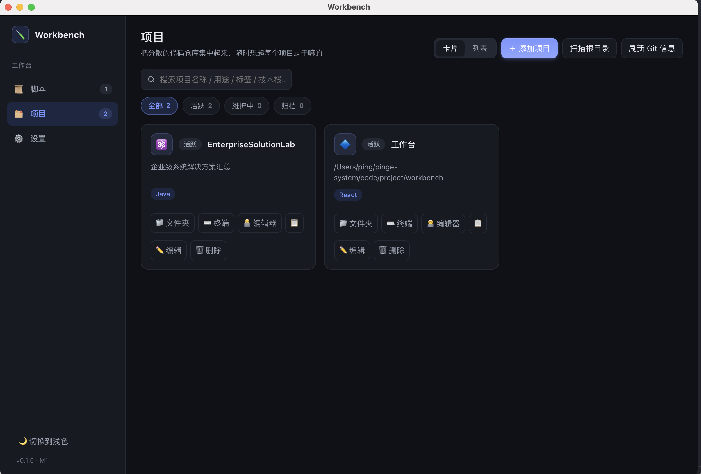
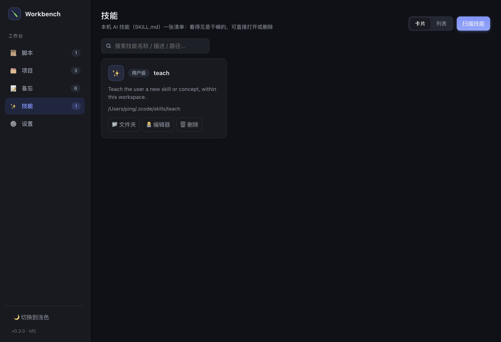

# Workbench 桌面工作台

一个本地桌面应用，把四件日常琐事集中到一块可视化工作台：

1. **脚本管理**：把散落在各处的常用脚本集中登记、分组、一键执行，实时看日志。
2. **项目仓库管理**：把分散在不同本地文件夹下的代码项目集中登记，随时想起“这个项目当初是干嘛的”。
3. **备忘**：随手记录想法、管理待办任务，勾选完成、按优先级与截止日期排序。
4. **技能管理**：把散落在用户级 / 项目级目录里的 AI 技能（`SKILL.md`）汇总成一张清单，看得见是干嘛的，可直接打开或删除。

> 当前版本：v0.3.0（macOS）· M1 一期 + 备忘 + 技能管理完成，处于日常自用阶段。

## 📸 界面预览









## ✨ 功能

**脚本模块**
- 手动添加 / 扫描目录自动发现（`.sh` / `.command` / `.py` / `.js`）
- 分组管理 + 执行前确认开关 + 自定义图标与配色
- 一键执行（zsh / bash），可停止进程树
- 实时流式日志（进度条也能滚动），ANSI 彩色控制符自动清洗，中英文/GDK 编码兼容
- 历史保留最近 5 次，支持查看 / 复制 / 一键清理

**项目模块**
- 手动添加 / 扫描 Git 仓库自动发现（可配置多个根目录）
- 自动读取 README 作用途草稿、按扩展名猜测技术栈
- 状态筛选（活跃 / 维护中 / 归档）、标签、图标
- 快捷操作：打开文件夹、终端、**编辑器**、复制路径
- **编辑器按技术栈自动选择**：Java/Gradle → IntelliJ IDEA、Python → PyCharm、前端栈 → VS Code，未识别回退默认编辑器
- Git 信息展示：当前分支 / 最后提交 / 未提交改动 / 远程地址

**技能模块**
- 扫描登记：自动发现 `~/.zcode/skills`（用户级）和各项目 `.zcode/skills`（项目级）下的技能，目录内含 `SKILL.md` 即识别；插件缓存目录不参与扫描，从源头规避误删
- 描述自动读取 `SKILL.md` frontmatter，未填写则回退目录名
- 清单展示名称 / 描述 / 路径 / 来源（用户级 / 项目级），支持搜索、卡片与列表视图
- 快捷操作：Finder 打开目录、用默认编辑器（VS Code）打开
- 删除走系统废纸篓（可恢复）并二次确认；磁盘上已不存在的条目标记「已失效」，可一键清理登记
- 技能数据随 JSON 备份一起导出 / 导入

**备忘模块**
- 想法与待办统一记录，侧边栏第 3 项「备忘」页签
- 待办支持勾选完成（已完成折叠）、截止日期、优先级（高/中/低）
- 筛选（全部 / 想法 / 待办）+ 标题/正文搜索；待办按优先级 + 创建时间排序
- 数据随 JSON 备份一起导出 / 导入

**通用**
- 单窗口五页签（脚本 / 项目 / 备忘 / 技能 / 设置）、模糊搜索、卡片与列表两种视图
- 浅色 / 深色主题（跟随系统或手动切换）
- 数据存本地 SQLite，支持 JSON 备份导出与导入恢复（导入前自动备份）

## 🛠 技术栈

- Electron 33 + electron-vite
- React 18 + TypeScript
- better-sqlite3（本地存储）
- electron-builder（打包）

## 🚀 快速开始

```bash
npm install          # 安装依赖（postinstall 会自动重建 better-sqlite3）
npm run dev          # 开发模式
npm start            # 预览构建产物
```

质量门：

```bash
npm run typecheck    # TypeScript 检查（主进程 + 渲染进程）
npx eslint src       # 代码规范
npm run build        # 构建到 out/
```

打包（当前仅 macOS，未签名，首次打开需“右键 → 打开”）：

```bash
npm run pack:mac                              # arm64
npx electron-builder --mac --dir --arm64 --x64  # 双架构
```

## 📂 目录结构

```text
workbench/
├── src/
│   ├── main/          # Electron 主进程（执行器 / IPC / 服务）
│   ├── preload/       # 安全桥接
│   ├── renderer/      # React 界面（脚本 / 项目 / 备忘 / 技能 / 设置）
│   └── shared/        # 共享类型与日志清洗等工具
├── doc/               # 项目文档（PRD / Plan / Task / Test / Deploy）
│   └── History/       # 变更与决策记录（按日期文件夹 + 标题归档）
├── release/           # 打包产物（git 忽略）
└── README.md
```

## 💾 数据

- 数据库：`~/Library/Application Support/Workbench/workbench.db`
- 备份：设置页可导出 JSON；导入前会自动备份当前数据到 `userData/backups`

## 📚 文档

- `doc/README.md`：文档索引（PRD / Plan / Task / Test / Deploy）
- `doc/History/`：变更、决策与迭代记录

## 📄 许可证

MIT
